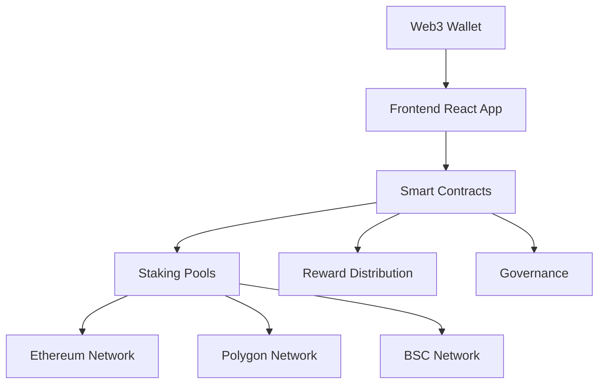

# 🚀 StakeRise - Decentralized Staking Platform

<div align="center">

**Secure, Multi-Chain Staking Platform for Passive Crypto Income**

[](https://opensource.org/licenses/MIT)
[](https://nodejs.org/)
[](https://ethereum.org/)
[](https://reactjs.org/)
[](https://hardhat.org/)

[**🌐 Live Demo**](https://stakerise.io) • [**📖 Documentation**](./docs/) • [**🔗 API Reference**](./docs/API.md) • [**💬 Discord**](https://discord.gg/stakerise)

</div>

---

## 🎯 **What is StakeRise?**

StakeRise is a **next-generation decentralized staking platform** that enables cryptocurrency holders to earn passive income by staking their digital assets across multiple blockchain networks. Built with security, transparency, and user experience as core principles.

### ✨ **Why Choose StakeRise?**

- 🔒 **Security First** - Industry-leading security practices with audited smart contracts
- 🌐 **Multi-Chain Support** - Stake across Ethereum, Polygon, and Binance Smart Chain
- 📊 **Real-Time Analytics** - Track performance with comprehensive dashboards
- 🔄 **Auto-Compounding** - Maximize returns with automated reward reinvestment
- 💼 **Flexible Options** - Choose from various staking periods and strategies
- 👥 **User-Friendly** - Intuitive interface for beginners and experts alike

---

## 🌟 **Key Features**

### **🔗 Multi-Chain Staking**
```
Ethereum (ETH) ━━━━━━━━━━━━━━━━━━━ 5.2% APY
Polygon (MATIC) ━━━━━━━━━━━━━━━━━ 8.7% APY
Binance Smart Chain (BNB) ━━━━━━━ 6.4% APY
Coming Soon: Solana, Cardano...
```

### **💰 Flexible Staking Options**
- **Flexible Staking** - Unstake anytime with daily rewards
- **Fixed Terms** - Lock assets for 30/90/180 days for higher APY
- **Liquid Staking** - Receive derivative tokens while earning rewards
- **Auto-Compound** - Reinvest rewards automatically

### **📈 Advanced Analytics**
- Real-time portfolio tracking
- Reward history and projections
- Performance comparisons
- Risk assessment tools

### **🛡️ Security Features**
- Multi-signature wallets
- Time-locked withdrawals
- Emergency pause mechanisms
- Regular security audits

---

## 🏗️ **Architecture**



### **Tech Stack**

| Component | Technology | Purpose |
|-----------|------------|---------|
| **Smart Contracts** | Solidity 0.8.19+ | Core staking logic and security |
| **Frontend** | React 18 + TypeScript | User interface and Web3 integration |
| **Backend** | Node.js + Express | API services and data processing |
| **Web3 Integration** | ethers.js + wagmi | Blockchain interactions |
| **Testing** | Hardhat + Waffle + Chai | Contract testing and deployment |
| **CI/CD** | GitHub Actions | Automated testing and deployment |

---

## 🚀 **Quick Start**

### **Prerequisites**
- Node.js 14.0+ and npm/yarn
- MetaMask or compatible Web3 wallet
- Basic understanding of DeFi and staking

### **1. Installation**
```bash
# Clone the repository
git clone https://github.com/ChronoCoders/stakerise.git
cd stakerise

# Install dependencies
npm install

# Copy environment variables
cp .env.example .env
```

### **2. Configuration**
Edit `.env` file with your settings:
```env
# Network Configuration
REACT_APP_NETWORK_ID=1
REACT_APP_RPC_URL=https://mainnet.infura.io/v3/YOUR_PROJECT_ID

# Contract Addresses (will be set after deployment)
REACT_APP_STAKING_CONTRACT=0x...
REACT_APP_REWARD_TOKEN=0x...

# API Configuration
REACT_APP_API_URL=http://localhost:3001
```

### **3. Development**
```bash
# Start local blockchain (for development)
npx hardhat node

# Compile smart contracts
npm run compile

# Run tests
npm run test

# Deploy contracts to local network
npm run deploy:local

# Start frontend development server
npm run dev:frontend

# Start backend API server
npm run dev:backend
```

### **4. Access the Application**
Open [http://localhost:3000](http://localhost:3000) in your browser.

---

## 📖 **Usage Guide**

### **Connect Your Wallet**
1. Click "Connect Wallet" button
2. Select MetaMask or your preferred wallet
3. Approve the connection

### **Start Staking**
1. **Choose Asset** - Select cryptocurrency to stake
2. **Select Pool** - Pick staking option (flexible/fixed/liquid)
3. **Enter Amount** - Specify how much to stake
4. **Confirm** - Review details and confirm transaction
5. **Earn Rewards** - Watch your rewards accumulate in real-time

### **Monitor Performance**
- **Dashboard** - Overview of all staking positions
- **Analytics** - Detailed performance metrics
- **History** - Transaction and reward history
- **Portfolio** - Asset allocation and projections

---

## 🛠️ **Development**

### **Project Structure**
```
stakerise/
├── contracts/              # Smart contracts
│   ├── StakeRise.sol       # Main staking contract
│   ├── RewardToken.sol     # Reward token implementation
│   └── governance/         # Governance contracts
├── scripts/                # Deployment scripts
├── test/                   # Contract tests
├── frontend/               # React frontend
│   ├── src/
│   │   ├── components/     # Reusable components
│   │   ├── pages/          # Page components
│   │   ├── hooks/          # Custom React hooks
│   │   └── utils/          # Utility functions
├── backend/                # API backend
│   ├── routes/             # API routes
│   ├── services/           # Business logic
│   └── middleware/         # Express middleware
├── docs/                   # Documentation
└── config/                 # Configuration files
```

### **Smart Contract Development**
```bash
# Compile contracts
npm run compile

# Run comprehensive tests
npm run test

# Run tests with coverage
npm run coverage

# Deploy to testnet
npm run deploy:testnet

# Verify contracts
npm run verify
```

### **Frontend Development**
```bash
# Start development server
npm run dev:frontend

# Build for production
npm run build:frontend

# Run linting
npm run lint:frontend

# Run type checking
npm run type-check
```

### **Testing**
```bash
# Run all tests
npm test

# Run contract tests only
npm run test:contracts

# Run frontend tests only
npm run test:frontend

# Run with coverage
npm run test:coverage
```

---

## 📊 **Supported Networks & Assets**

### **Mainnet**
| Network | Assets | Status | APY Range |
|---------|--------|--------|-----------|
| **Ethereum** | ETH, USDC, USDT | ✅ Live | 3.5% - 7.2% |
| **Polygon** | MATIC, USDC | ✅ Live | 6.8% - 12.4% |
| **BSC** | BNB, BUSD | ✅ Live | 4.2% - 8.9% |

### **Testnet**
| Network | Purpose | Status |
|---------|---------|--------|
| **Goerli** | Ethereum testing | ✅ Active |
| **Mumbai** | Polygon testing | ✅ Active |
| **BSC Testnet** | BSC testing | ✅ Active |

---

## 🔒 **Security**

### **Audit Reports**
- [Q4 2024 - CertiK Audit](./docs/audits/certik-2024-q4.pdf) ✅
- [Q1 2025 - Quantstamp Audit](./docs/audits/quantstamp-2025-q1.pdf) ✅

### **Security Practices**
- **Multi-signature** wallets for admin functions
- **Timelock** contracts for critical changes
- **Emergency pause** mechanisms
- **Reentrancy protection** on all external calls
- **Access control** with role-based permissions

### **Bug Bounty Program**
We offer rewards for responsibly disclosed security vulnerabilities:
- **Critical**: Up to $50,000
- **High**: Up to $25,000
- **Medium**: Up to $5,000

Report security issues to: [security@stakerise.io](mailto:security@stakerise.io)

---

## 🗺️ **Roadmap**

### **Phase 1: Foundation** ✅ *Completed Q4 2024*
- ✅ Core staking contracts development
- ✅ Basic frontend implementation
- ✅ Ethereum mainnet deployment
- ✅ Security audit completion

### **Phase 2: Multi-Chain** 🔄 *In Progress Q1 2025*
- ✅ Polygon network integration
- ✅ BSC network support
- 🔄 Cross-chain bridge functionality
- 🔄 Unified portfolio management

### **Phase 3: Advanced Features** 📅 *Q2 2025*
- 🔜 Liquid staking derivatives
- 🔜 Governance token launch
- 🔜 Yield farming strategies
- 🔜 Mobile application

### **Phase 4: DeFi Integration** 📅 *Q3 2025*
- 🔜 Integration with major DeFi protocols
- 🔜 Automated yield optimization
- 🔜 Flash loan protection
- 🔜 Insurance coverage options

### **Phase 5: Ecosystem** 📅 *Q4 2025*
- 🔜 Developer API and SDKs
- 🔜 Third-party integrations
- 🔜 Institutional features
- 🔜 Advanced analytics tools

---

## 📈 **Analytics & Metrics**

### **Platform Statistics** *(Updated Daily)*
```
Total Value Locked (TVL): $24.7M
Active Stakers: 3,247
Total Rewards Distributed: $1.8M
Networks Supported: 3
Average APY: 7.4%
```

### **Performance Metrics**
- **Uptime**: 99.9%
- **Transaction Success Rate**: 99.7%
- **Average Response Time**: 1.2s
- **User Satisfaction**: 4.8/5

---

## 🤝 **Contributing**

We welcome contributions from the community! Here's how you can help:

### **Ways to Contribute**
- 🐛 **Bug Reports** - Found an issue? Let us know!
- 💡 **Feature Requests** - Suggest new features
- 🔧 **Code Contributions** - Submit pull requests
- 📖 **Documentation** - Help improve our docs
- 🌍 **Translations** - Localize StakeRise

### **Development Workflow**
1. **Fork** the repository
2. **Create** a feature branch (`git checkout -b feature/amazing-feature`)
3. **Commit** your changes (`git commit -m 'Add amazing feature'`)
4. **Push** to the branch (`git push origin feature/amazing-feature`)
5. **Open** a Pull Request

### **Code Standards**
- Follow ESLint configuration
- Write comprehensive tests
- Update documentation
- Use conventional commits

---

## 📞 **Support & Community**

### **Get Help**
- 📖 **[Documentation](./docs/)** - Comprehensive guides
- 💬 **[Discord](https://discord.gg/stakerise)** - Community chat
- 🐦 **[Twitter](https://twitter.com/StakeRise)** - Updates and news
- 📧 **[Email Support](mailto:support@stakerise.io)** - Direct assistance

### **Community Links**
- **Website**: [stakerise.io](https://stakerise.io)
- **Blog**: [blog.stakerise.io](https://blog.stakerise.io)
- **Medium**: [@StakeRise](https://medium.com/@StakeRise)
- **Telegram**: [t.me/StakeRise](https://t.me/StakeRise)

---

## ⚖️ **Legal & Compliance**

### **License**
This project is licensed under the [MIT License](LICENSE) - see the LICENSE file for details.

### **Disclaimer**
StakeRise is experimental software. Please use at your own risk. Always do your own research before staking any assets.

### **Terms of Service**
By using StakeRise, you agree to our [Terms of Service](https://stakerise.io/terms) and [Privacy Policy](https://stakerise.io/privacy).

---

<div align="center">

## 🌟 **Start Earning Today!**

**Ready to maximize your crypto earnings?**

[**🚀 Launch App**](https://stakerise.io) • [**📖 Read Docs**](./docs/) • [**💬 Join Community**](https://discord.gg/stakerise)

**Made with ❤️ by the ChronoCoders Team**

*© 2025 StakeRise. All Rights Reserved.*

</div>

